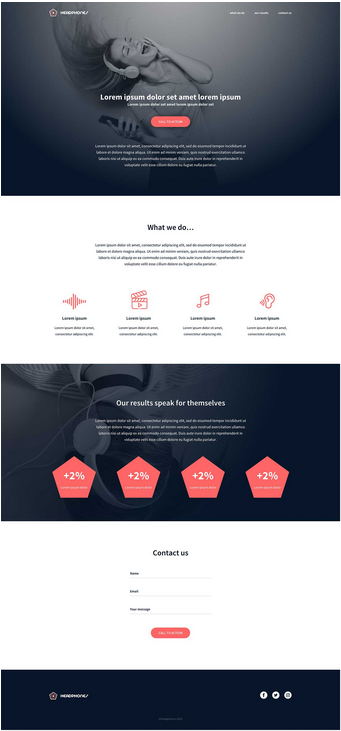

# holbertonschool-headphones

In this project, we will implement from scratch, without any library, a web page. We will use all HTML/CSS/Accessibility/Responsive design knowledges that we learned previously.

The objective is simple: Have a fully functional web page that looks the same as the designer file.

